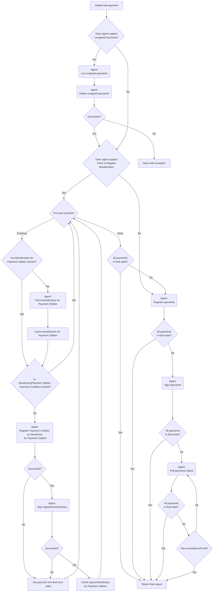

# Bulk payment initiation

Flow chart of bulk payment initiation:

```mermaid
flowchart TD
    Start[Initiate bulk payment] --> SupportUnsigned{Does agent support\n Unsigned Payments?}
    SupportUnsigned -- Yes --> ListUnsigned(Agent:\nList unsigned payments);
    ListUnsigned --> DeleteUnsigned(Agent:\nDelete unsigned payments)
    DeleteUnsigned --> DeleteUnsignedResult{Successful?}
    DeleteUnsignedResult -- Yes --> SupportBeneficiary
    DeleteUnsignedResult -- No --> Abort[Abort with exception]
    SupportUnsigned -- No --> SupportBeneficiary{Does agent support\n Fetch & Register Beneficiaries}
    SupportBeneficiary -- Yes --> BeneficiaryLoop{For each payment}
    SupportBeneficiary -- No --> RegisterPayments
    BeneficiaryLoop -- Continue --> HaveFetchedBeneficiaries{Are Beneficiaries for\nPayment::Debtor cached?}
    BeneficiaryLoop -- Done --> AllPaymentsInFinalState1{All payments\n in final state?}
    HaveFetchedBeneficiaries -- Yes --> IsBeneficiaryCached{"Is beneficiary{Payment::Debtor,\n Payment::Creditor} cached?"}
    HaveFetchedBeneficiaries -- No --> FetchBeneficiaries(Agent:\nFetch beneficiaries for Payment::Debtor)
    FetchBeneficiaries --> CacheBeneficiaries[Cache beneficiaries for Payment::Debtor]
    CacheBeneficiaries --> IsBeneficiaryCached
    IsBeneficiaryCached -- Yes --> BeneficiaryLoop
    IsBeneficiaryCached -- No --> RegisterBeneficiary(Agent:\nRegister Payment::Creditor as beneficiary\n for Payment::Debtor)
    RegisterBeneficiary --> RegisterBeneficiaryResult{Successful?}
    RegisterBeneficiaryResult -- No --> RemoveBeneficiaryPayment[Set payment into final error state]
    RemoveBeneficiaryPayment --> BeneficiaryLoop
    RegisterBeneficiaryResult -- Yes --> SignBeneficiary(Agent:\nSign registered beneficiary)
    SignBeneficiary --> SignBeneficiaryResult{Successful?}
    SignBeneficiaryResult -- Yes --> CacheSignedBeneficiary[Cache signed beneficiary\n for Payment::Debtor]
    SignBeneficiaryResult -- No --> RemoveBeneficiaryPayment
    CacheSignedBeneficiary --> BeneficiaryLoop
    AllPaymentsInFinalState1 -- Yes --> ReturnFinalReport[Return final report]
    AllPaymentsInFinalState1 -- No --> RegisterPayments(Agent:\nRegister payments)
    RegisterPayments --> AllPaymentsInFinalState2{All payments\n in final state?}
    AllPaymentsInFinalState2 -- Yes --> ReturnFinalReport
    AllPaymentsInFinalState2 -- No --> SignPayments(Agent:\nSign payments)
    SignPayments --> AllPaymentsInFinalState3{All payments\n in final state?}
    AllPaymentsInFinalState3 -- Yes --> ReturnFinalReport
    AllPaymentsInFinalState3 -- No --> PollPaymentsStatus(Agent:\nPoll payments status)
    PollPaymentsStatus --> AllPaymentsInFinalState4{All payments\n in final state?}
    AllPaymentsInFinalState4 -- Yes --> ReturnFinalReport
    AllPaymentsInFinalState4 -- No --> PollExceededTime{Has exceeded poll time?}
    PollExceededTime -- Yes --> ReturnFinalReport
    PollExceededTime -- No --> PollPaymentsStatus
```
